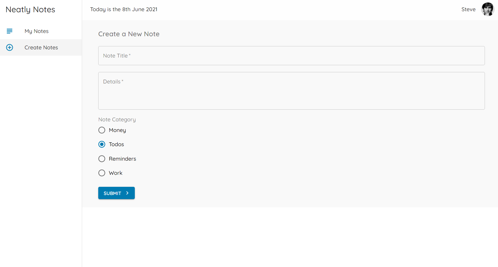
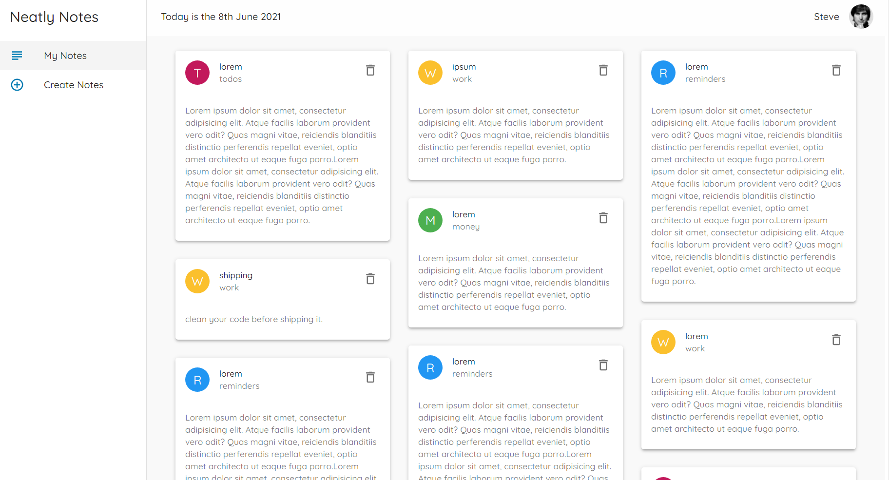

# Neatly Notes

## About the project and Glimpse of what I have created

In this project I have used material-UI and some of its functionality to practice, learn and tried to implement.

To create new Note



All the notes


## Tech Stack used

Project is created with :
ReactJS, Material-UI, react-masonry-css

## Install and Run

1. Download the repo

```
$ cd neatly-notes
```

2. Install the dependencies:

```
$ npm install
```

3. Run the development server:

```
$ npm start
```

4. Run the json-server:

```
$ json-server --watch data/db.json --port 8000
```

5. Wait for the React to open build environment in development mode in browser
